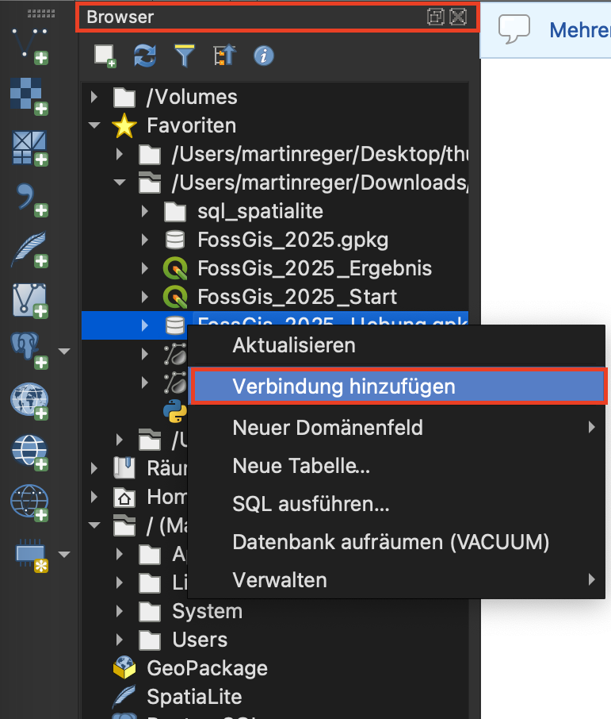
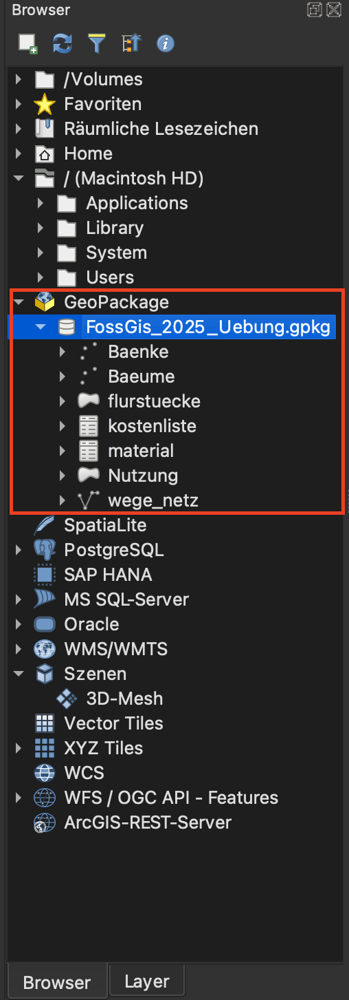
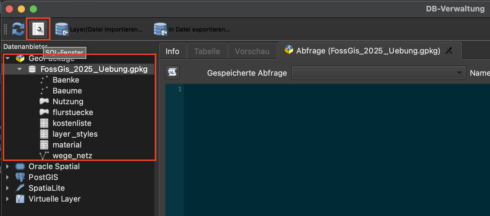
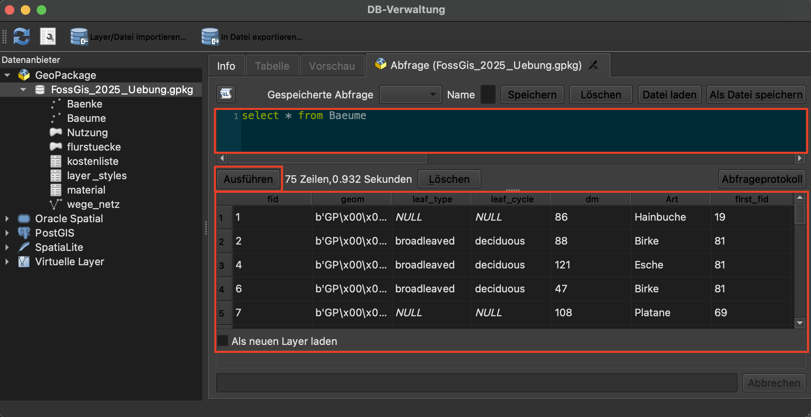

# Trigger & Views in Geopackages
Da Geopackages auf SQLite basieren, ist es möglich, Trigger und Views in Geopackages zu erstellen - ähnlich wie in PostGIS und PostgreSQL.
Es gibt allerdings einige Besonderheiten, die dabei zu beachten sind. Im folgenden werden die nötigen Schritte beschrieben.<br>
## Geopackage öffnen
Über die QGIS-DB-Verwaltung kann man sich mit einem Geopackage verbinden. Dazu muss man zuerst im Browser-Fenster nach dem gewünschten Geopackage suchen und mit einem Rechtsklick aus dem Menü **Verbindung hinzufügen** auswählen:<br>
<br><br>
Danach ist das Geopackage unter **GeoPackage** im Browserfenster mit den registrierten Tabellen sichtbar:<br>
<br><br>
Nun kann man über die DB-Verwaltung in QGIS über die markierte Schaltfläche oben links ein SQL-Abfragefenster zum ausgewählten Geopackage öffnen<br>
<br><br>
Im SQL-Abfragefenster können nun beliebige Abfragen, die mit SQLite kompatibel sind, ausgeführt werden. Im Gegensatz zu PostgreSQL/PostGIS muss kein Schema vor den Tabellennamen. Bitte beachten, dass die Syntax zwar ähnlich zu PostgreSQL/PostGIS ist, aber nicht alle Funktionalitäten komplett identisch sind. Die Ausgabe wird unter dem Fenster der SQL-Eingabe angezeigt.<br>
<br><br>
## Erstellung von Views
Eine View in einem Geopackage zu erstellen funktioniert grundsätzlich ähnlich wie in PostgreSQL/PostGIS:<br>
`CREATE VIEW viewname AS ...gewünschtes SQL-Statement (z.B. SELECT * FROM ...)...`<br>
Der Unterschied beim Geopackge ist allerdings, dass die View erst im Geopackage registriert werden muss, damit sie in QGIS sichtbar wird. Das muss in der Tabelle **gpkg_contents** passieren. Um die Eintragung vorzunehmen, kann folgendes SQL-Statement ausgeführt werden:<br>
### Wenn es sich um eine geometrielose View oder Tabelle handelt:
An dieser Stelle muss **attributes** als Data-Type angegeben werden, aber keine **srs_id**, da es kein Koordinatensystem braucht, wenn keine Geometrie vorliegt.
```
insert into gpkg_contents (table_name, data_type, identifier, srs_id)
values ('viewname', 'attributes', 'viewname', 0)
```
### Wenn es sich um eine View oder Tabelle mit Geometrie handelt:
Hier muss **features** als Data-Type angegeben werden und außerdem die ID des Koordinatensystems (z.B. 25832).
```
insert into gpkg_contents (table_name, data_type, identifier, srs_id)
values ('viewname', 'features', 'viewname', 25832)
```
