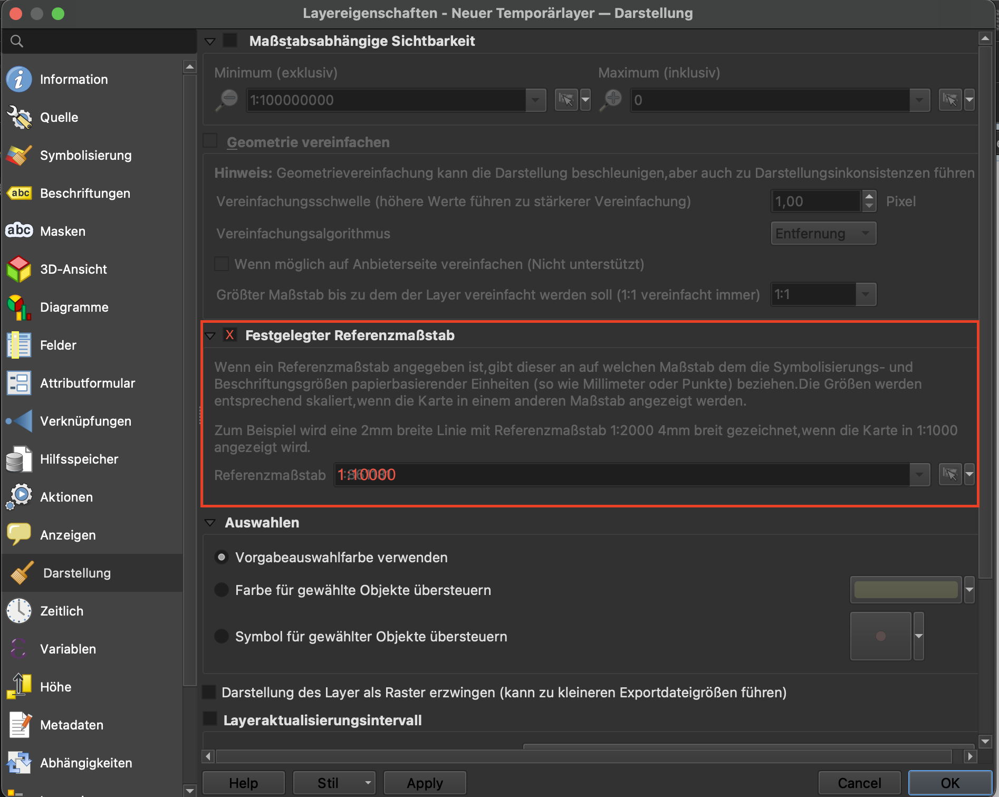

# Beschriftungen in QGIS
## Labels mit vorgegebenem Referenzmaßstab
Es ist möglich, der Beschriftung eines Layers einen vrogegebenen Referenzmaßstab zuzuteilen. Dazu in den Layereigenschaften den Reiter **Darstellung** öffnen und das Häkchen an der entsprechenden Stelle setzen. Durch Eingabe eines **Referenzmaßstabs** sehen alle Beschriftungen (und auch Symbole) im angegebenen Maßstab so aus, wie festgelegt. Stile und Beschriftungen werden in anderen Ansichtsmaßstäben dadurch interpoliert.

